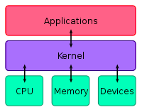
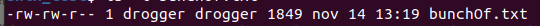
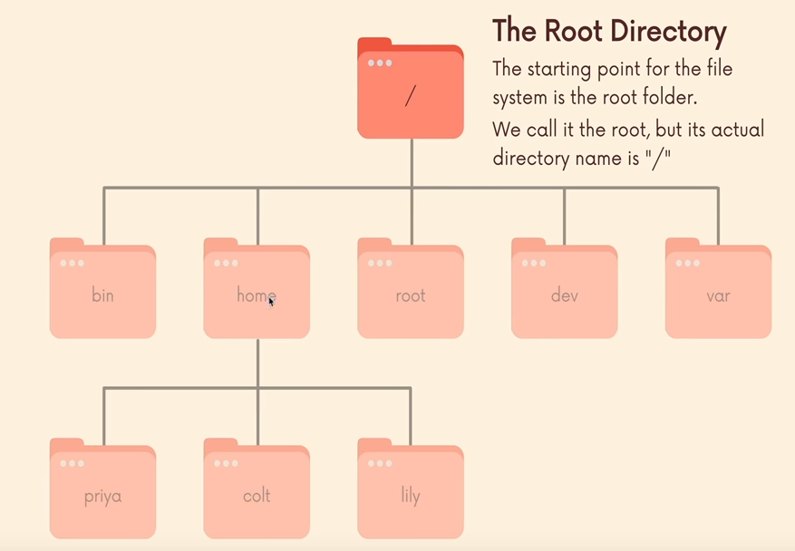

anotações pessoais.

# **Unix**

Foi criado nos anos 60 por Ken Thompson e Dennis Ritchie, usando a linguagem C, com as funcionalidades de suporte multi usuário e multitarefa com uma grande portabilidade, pode ser adaptado para diversos tipos de S.O sem esforço.

Ubunto e macOS são unix a like (tipo unix, que usam o conceito unix).

## Unix possui 3 níveis

1. **Kernel:** responsável pela interação software e o hardware, gerenciamento de memória, processos e arquivos.

2. **Shell**: Interface entre o SO e o usuário, onde o usuário escreve ou interage, para ser interpretada e retornar um resultado. 
**Exemplos de shell:** login, linha de comando(terminal) ou interface gráfica.
Função do shell é de ler a linha de comando interpretar seu significado, executar o comando e devolver um resultado.
**Tipos de Shell:** SH, BASH, CSH, TCSH e ZSH.

3. Aplicativos, softwares e comandos Unix.

## Processo e arquivos

Tudo que você faz no Unix é considerado um processo, todo processo possui um identificador único, PID com o proprietário, sessão do shell, estado atual.

## Arquivos

Tudo no Unix é considerado como arquivo, arquivos são arquivos, pastas são arquivos.

Todo arquivo possui uma série de informações como:

Tipo, permissões, dono, grupo, tamanho, criação/ultima modificação, nome

## Sistema de organização

A organização no Unix é hierárquica de raiz, o nível mais alto representado por barra " / ".

Explicação de diretórios:

**/** = root ponto mais alto, ponto inicial.

**boot:** arquivos de inicialização

**bin:** aplicativos binários

**dev:** arquivos do dispositivo

**etc:** scripts de inicialização

**home:** diretório para diferentes usuários

**proc:** diretório que mantém informações sobre o estado do sistema.

**root:** diretório home do root

**sbin:** binário de sistema importante.

**tmp:** arquivos temporários

**usr:** Aplicativos, maioria das vezes disponível há todos.

## Comandos terminal

# Conclusão da Semana

1. Foi introduzido toda funcionalidade do curso e bons hábitos para melhor interação com os instrutores e meus "peers" colegas de classe.
2. Introdução da importância de Soft-skills(Interação com outras pessoas, empatia).
3. Criação do Linkedin, e forma de como melhora-lo para contratação.
4. Aprendi diversas habilidades técnicas dentro do ambiente tipo Unix, com diversos comandos, e suas funcionalidades.
5. Tivemos no plantão de lógica, uma atividade em grupo, para resolução no racha cuca.
6. E por fim, um desafio, para mensurar nível lógico de cada turma, com 15 soluções, consegui executar 5~6 "problemas.