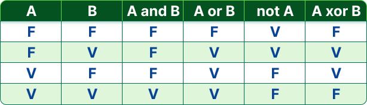
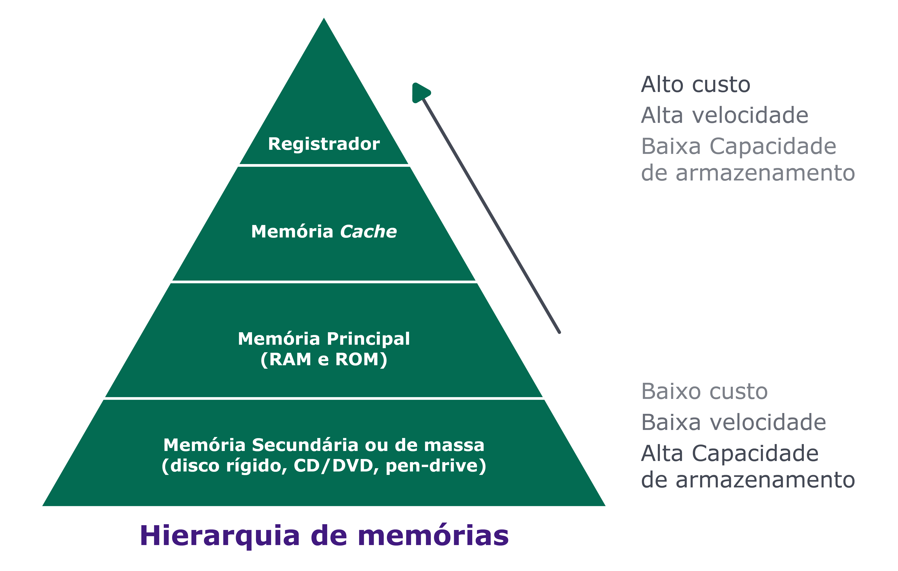

# Ada Lovelace e o primeiro programa de computador

A matemática, escritora e condessa Augusta Ada Byron King - mais conhecida como Ada Lovelace -, que nasceu em Londres no ano de 1815, foi a primeira programadora do mundo. Ela é responsável pelo primeiro algoritmo que foi usado por uma calculadora chamada de máquina analítica, o mais próximo do que seria um computador no começo do século XIV.

Ela sugeriu uma plano de como a máquina poderia calcular os números de Bernoulli, sequência matemática de números racionais profundamente relacionada com a teoria dos números. Este plano é considerado o primeiro programa de computador do mundo.

Em 1979, o deparamento de desafesa dos estados unidos desenvolveu uma linguagem de programação, e em homenagem à autora do primeiro programa que foi rodado em uma máquina, chamou a linguagem de Ada.

# Alan Turing e os primeiros computadores

Morreu um pouco antes de completar 42 anos de vida, cientista da computação, matemático, lógico, cripto analista, filosofo e biologo.
Um dos maiores feitos dele foi na realização da quebra de criptografia utilizada na guerra pela alemanha nazista na segunda guerra mundial.
A principal contribuição para parte de desenvolvimento, foram as máquinas de turing, o estudo dessas máquinas deu base para tudo que temos hoje com relação a processamento.
Máquinas de turing são dispositivos teoricos e hipotético, que não possuem limite de memória, permitindo com a entrada de qualquer tamanho, e sempre nos darão uma saida, diferente dos nossos computadores atuais que possuem uma memória ram limitada, elas são compostas por estados e transições.

# Máquinas de turing reconhecedoras

Uma classe que tem como caracteristica de uma determinada entrada, reconhece-la ou rejeita-la, isso pode ser abstraido para linguagem de programação, onde digitarmos nosso codigo no editor, ele poderá ser reconhecido ou não, ele poderá compilado ou não e as máquinas de turing fazem isso reconhecem a palavra, se elas fazem parte ou não do vocabulario de uma linguagem, podendo nos indicar problemas lexus ou de sintáticos e semânticos no código. Muito similar ao que acontece, quando executamos um código.

Turing definiu o conceito de algoritmo, que na época não era definido. Por meio dos estudos de Turing, podemos criar novas linguagens de programação, novos compiladores, novos frameworks entre outras coisas.

# Computadores Modernos

## Modelo de Von Neumann

Celulares, tables, video-games, smartwatches entre outros, funciona com base no modelo inventando em 1945 pelo matemático John Von Neumann, esse modelo define um computador como uma máquina que possui dois elementos principais: uma memória principal (como a memória RAM), onde podemos registrar e ler instruções e dados e um processador (CPU), responsável por buscar tais informações, realizar os cálculos e armazenar os resultados novamente na memória.

# Lógica binária

O sistema binário foi inventando pelo matemático alemão Gottfried Leibniz, no século 18. Os computadores processam informações baseando-se no sistema binário com o que chamamos de bits. Um bit é a menor unidade em um sistema digital e pode assumir o valor 0 ou 1. Eletronicamente esse valor pode ser representado pela prsença ou ausência de tensão ou corrente elétrica.

O bit é representado por um "b" (minúsculo) é o agrupamento de 8 bits correspondem à 1 byte, representado por um "B" (maiúsculo). 1 byte é capaz de armazenar um valor decimal de 0 e 255 (000 000 e 111 1111).

Relembre também as unidades de medidas com a tabela abaixo:

- Convencionalmente, a presença de tensão ou corrente elétrica pode ser considerada como verdadeiro, 1, e a ausência como false, 0;

- Os dispositivos que podem se comportar como chaves eletrônicas são os transistores, onde a tensão ou corrente na entrada resulta na presença ou ausência de uma tensão ou corrente na saída;

- Transistores podem ser agrupados de maneira a formarem as portas lógicas NOT, AND, OR, XOR, entre outras. Estas porta slógicas apresentam, para uma mesma combinação de valores de entrada (conjunto de fios com ou sem tensão/corrente elétrica 0s e 1s), a mesma saída. As portas lógicas seguem a mesma ideia das condicionais utilizadas nas linguagens de programação, como podemos ver na tabela:

- Portas lógicas podem formar circuitos de soma de bits. Daí temos adição, subtração, multiplicação, divisão, e assim sucessivamente, sempre seguindo a lógica binária.

# Memória Principal - RAM

É um dispositivo ou sistema usado para armazenar informações para uso imediato em um computador ou hardware de computador, ou, ainda, dispostivos eletrônicos digitais. o Termo memória é muitas vezes sinônimo do termo armazenamento primário ou memória principal. De maneira simples, pode-se dizer que memória é um conjunto de blocos endereçáveis que guardam dados.

# Memória principal: uma grande biblioteca

A memória principal pode ser vista como uma grande biblioteca, possuindo diversas prateleiras, cada uma com a capacidade de armazenar alguns livros. Para organizar e tornar fácil a localização de um livro entre os corredores e seções, cada prateleira possui um identificador único, um endereço, que permite que um livro específico seja facilmente localizado.

# Células

Essas diversas "prateleiras" são as células da memória principal, cada uma sendo capaz de armazenar uma informação (ou um fragmento de uma) e, para localizá-las, são utilizados seus endereços, os chamados ADDRESSES ou ADDR.

Cada célula pode armazenar diversas informações como dados para serem processados, incluindo endereço de outras células, instruções e resultados de processamentos. Essas informações são armazenadas em bits e as células possuem uma capacidade limitada de armazenamento: por exemplo, 8 bits (1 byte) por célula.

A capacidade total da memória é dada pela quantidade de suas células multiplicada pela capacidade de armazenamento de cada uma. Por exemplo, uma memória com 1024 células de 8 bits (1 byte) tem a capacidade de armazenar 1024 bytes (8192 bits), ou 1KB.

# Endereços

Cada célula possui um endereço único, que é chamado de address ou ADDR, e estes são um conjunto de números que, para o computador, é representado por um número binário como todo o resto, ou seja, utilizando somente os dígitos 0 ou 1.

A quantidade de dígitos utilizados para representar um endereço varia e, com ela, a quantidade de células endereçáveis. Se utilizarmos apenas 1 dígito, só poderemos localizar duas células, uma com endereço #0 e outra com o endereço #1. Se tivermos 2 dígitos, poderemos ter os endereços #00, #01, #10 e #11 e assim por diante. Normalmente a memória principal de um computador possui milares de endereços possíveis e mesmo computadores de pequeno porte possuem algumas centenas de células na memória.

O conceito de computador vai além dos computadores pessoais. Seguindo o modelo de Van Neumann, portanto essas características são válidas para diversos dispositivos, como seu smartphone, tablet, alguns computador de bordo de veículos, entre outros que usam essa arquitetura. As "máquinas de Turing" estão por toda parte.

# Processador - CPU

A unidade central de processamento, funciona em conjunto com a memória principal, lendo e executando as instruções e dados armazenados nela e gravando o resultado de tais processamentos.

# ULA (unidade lógico-aritmética)

É o componente responsável por realizar operações lógicas (como as realizadas pelas portas lógicas AND, OR, etc, entre outras operações lógicas) e aritméticas (como somas, subtrações, multiplicações, etc).

# Unidade de Controle

A unidade de controle é responsável por extrair dados da memória, decodificá-los e executá-los, consultando a ULA quando necessário.

# Registradores

O processador possui células internas de memória, chamadas de registradores. Neles, o processador vai armazenar os dados lidos da memória que está usando no processamento. As operações a serem realizadas também são representadas como números na memória, e um conjunto delas forma o que chamamos de uma instrução.

Exemplo: Ao realizar uma soma. A CPU funciona executando um loop desde sua inicialização, onde ela realiza a leitura de algumas instruções pré-definidas, executa elas e então passa a buscar e consequentemente a executar as instruções na memória.

A CPU pode ler da memória uma instrução, por exemplo, indicando para definir o valor do endereço #1000 0000 para 1000 1010. A partir disso, ela enviará um comando para a memória principal para atribuir o valor 1000 1010 para a célula de endereço #1000 0000. Da mesma forma, o processador consegue realizar outras operações matemáticas básicas buscando os dados de entrada e as instruções na memória e, então, salvando os resultados também na memória principal.

Dessa forma, tudo no computador é tratado como dados e instruções, sempre utilizando números através da representação binária.

Pense no que é um monitor de computador: uma matriz de pequenas luzes que chamamos de pixels.  Cada pixel é composto por três luzes: Uma vermelha (R) uma verde (G) e uma azul (B). Um byte codifica, em oito bits, o quão intensamente cada uma dessas três luzinhas deve se acender. Se quisermos exbir uma imagem em um monitor com resolução de 1280 pixels horizonstais por 720 pixels verticais (HD), são necessários 1280 x 720 x 3 = 2.764.800 bytes (quase 3MB) em memórias para armazenar a intensidade luminosa de cada luzinha presente no monitor. Realizando operações lógicas ou aritméticas nos valores armazenados na memória, mudamos a imagem que é exibida.

# Operações por segundo

Para gerenciar todas as atividades e a comunicação entre os componentes do computador, existe um componente eletrônico que gera um sinal de "clock". Esse sinal é uma alternância entre tensões altas e baixas a cada fração de tempo, seguindo a mesma ideia de representação de 0 e 1.

A frequência do clock é medida em hertz (Hz), ciclos por segundo. Ou seja, o número de operações básicas capazes de serem executadas em 1 segundo. O período de um clock é o tempo entre uma operação e outra.

Um computador com um processador com frequência de 1Hz consegue realizar uma operação básica por segundo. Esse número costuma ser muito maior, como 2GHz, o que significa que esse CPU consegue realizar cerca de 2 bilhoes de operações básicas (ciclos) por segundo, com cada ciclo demorando 0,0000000005 segundos ou 0,5 nanosegundos.

Um processador não necessariamente consegue executar uma instrução por ciclo, pois isso depende de sua arquitetura. Em processadores de computadores Desktop normalmente uma instrução possui de 5 a 10 operações básicas, fazendo com que a execução de uma instrução demore mais do que somente um ciclo.

Atualmente, existem diversos tipos de processadores com vários recursos para aumentar seu poder computacional, como, por exemplo, processadores multi-cores (com mais de um núcleo) com 4 ou 8 cores que conseguem processar muito mais instruções. Um quadcore (4 núcleos) com 2GHz, por exemplo, pode executar por volta de 1 bilhão de instruções por segundo, com algumas operações básicas cada uma.

# Barramentos

Ambos componentes realizam a troca constante de informações: o processador está constantemente buscando por instruções na memória e dados a serem processados e devolvendo os resultados desses processamentos para a memória.

Para realizar essa troca são realizados dois tipos de operações, uma sendo a leitura da memória para carregar quais são as instruções a serem executadas. Esses dados são lidos e gravados em registradores do processador. Esse processo é chamado de load. A outra operação é quando o processador precisa armazenar dados na memória como os resultados dos processamentos e das operações que ele realizou durante uma operação.
Esse processo é chamado de store.

Essas comunicações dos componentes são realizadas a partir de "vias" que ligam os dois componentes. Essas vias são chamadas de barramentos, que são conjuntos de fios. Conforme vimos, ambos componentes utilizam números binários representados por grandezas elétricas (tensão/corrente). Dessa forma, os barramentos conseguem comunicá-los transmitindo essas grandezas.

Basicamente a memória principal é ligada a CPU por 3 dessas vias:

- Endereço (ADDR): Indica o endereço da célula de memória para aquela operação;
- Dados (DATA): Transfere a informação da memória para a CPU e vice-versa.
- Controle(CTRL): Indica a "direção" dos dados para a operação, ou seja, se os dados serão transferidos da CPU para a memória (escrita) ou da memória para a CPU (leitura).

As linhas vista em placas de circuito, são os barramentos ligando diversas peças de diversas formas.

# Tipos de memória

Memórias são todos os dispositivos capazes de armazenar dados de maneira temporária ou permanente. Na arquitetura de computadores, dividimos as memórias em dois grandes grupos: memórias primárias e memórias secundárias.

- Memórias primárias são onde os dados e programas em execução são armazenados de maneira temporária para serem processadas pela CPU, conforme vimos no modelo de Von Neumann. São memórias de acesso rápido, com armazenamento de um menor volume de dados, que em geral, não conseguem guardar a informação quando são desligados.

- Memórias secundárias são onde os dados (arquivos) são armazenados. Possuem um acesso mais lento, mas são capazes de armazenar permanentemente grandes volumes de dados.

# Hierarquia das memórias

O CPU, antes de processar uma instrução, busca as informações da memória principal para seus registradores internos, que usará para realizar as operações. Porém, esse espaço dos registradores internos é bem pequeno, sendo capaz de armazenar apenas o dado para aquela operação que está sendo executada no momento.

Por isso, a CPU precisa constantemente trocar dados de seus registradores com a memória RAM. Perceba que esse processo precisa ser extremamente rápido, caso contrário a CPU ficará ociosa aguardando a transferência de dados com a memória, "desperdiçando" seus ciclos, o que impacta diretamente na performance dos processamentos.

A CPU acessa um dado em seus registradores quase que instantanemamente, em apenas um ciclo. Já para buscar um dado da memória esse tempo é um pouco maior: em computadores modernos, essa operação pode levar algumas centenas de ciclos, o que equivale a 1 microssegundo, o que parece bem rápido, porém, para a quantidade de leituras que são feitas para as execuções esse tempo se torna "uma eternidade".

Com o avanço da teçnolgoa a velocidade das CPUs cresceu de maneira exponencial. A velocidade das memórias também aumentou, porém sem conseguir acompanhar a evolução dos processadores. A velocidade delas está diretamente relacionada com seus preços, quanto mais rápida, mais cara.

Para aumentar o poder dos computadores, pessoas pesquisadoras desenvolveram estratégias para lidar com essas questãoes de memória. A principal foi a criação de uma herarquia de memórias. Essa hierarquia faz com que os dados que são acessados com mais frequencia sejam armazenados em memórias de acesso mais rápido. Por exemplo, os dados que estão sendo trabalhados pela CPU. Enquanto isso, os outros dados acessados com menos frequência são armazenados em memória mais baratas e lentas como, por exemplo, nossos arquivos no HD.

Em geral a hierarquia é composta da seguinte maneira:

# Registradores

Na ponta superior da pirâmide estão os registradores. Eles são utilizados para armazenar um volume pequeno de dados, possuindo altíssima velocidade.

# Memória Cache

Na sequência temos os caches L1, L2 e L3. Esses componentes são de acesso mais rápido do que a memória principal (sendo o L1 o mais rápido, em seguida o L2 e depois o L3) e são integrados à CPU. As memórias cache são utilizadas para armazenar alguns dados de maneira estratégica, como os dados que são lidos com maior frequência na RAM. Dessa forma, ao terem os dados encontrados nesse dispositivos, não é necessário buscá-los na memória principal, aumentando a performance do computador, tendo em vista que as chamadas a eles são centenas de vezes mais rápidas do que para a RAM.
Assim como no _cache do navegador ficam os dados dos sites que são acessador com mais frequência. O navegador os recupera de lá em vez de buscá-los no servidor para ser mais rápido.

# Memória principal (RAM e ROM)

Seguindo a hierarquia temos as memórias RAM e ROM, segundo a segunda somente leitura, é um tipo de memória que não permite escrita de dados, porém seus dados não são perdidos quando ela é desligada. Em geral, essas memórias são utilizadas para guardar configurações mais básicas do sistema como os dados para inicializar alguns componentes do computador.

# Memória secundária ou de massa

Por último temos as memórias secundárias como HD's, SSDs, CD/DVDs, pendrives e afins.
Esses dispostiivos são mais lentos por fazerem a gravação física das informações nos dispositivos, porém não perdem informações quando desligados e são capazes de armazenar grande volume de dados.
Vemos então, para concluir, que as memórias tem dois tradeoffs a se considerar:

- Velocidade versus volatilidade: memórias de escrita e leitura mais rápidas tendem a ser voláteis, ou seja, quando o computador é desligado os dados da memória são apagados! Nos HDs (não voláteis) isso não acontece. Na memória RAM (volátil) sim.
- Velocidade versus capacidade: memórias mais rápidas costumam ser mais caras, e por isso costumam ser comercializadas com capacidades menores. Um pente de 8 GB de RAM custa aproximadamente o mesmo que um SSD de 240GB ou que um HD de 1 TB.

