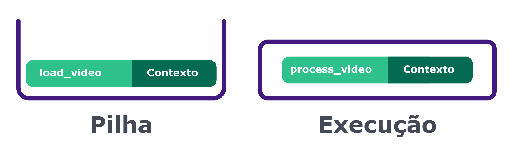
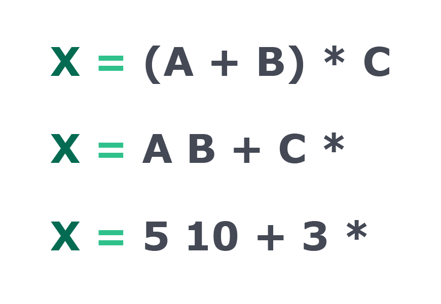
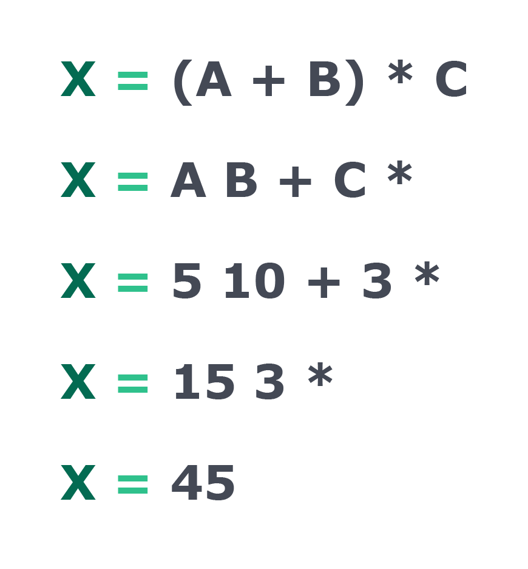
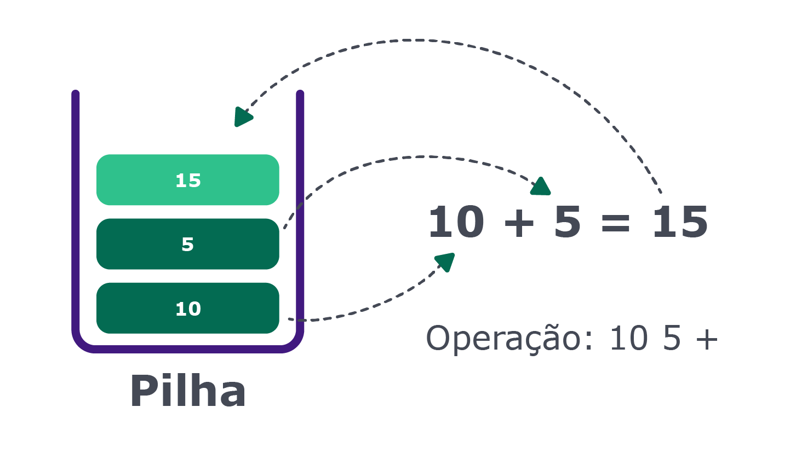

# O que é uma pilha?

A estrutura de pilha é uma estrutura do tipo LIFO (Last In First Out), o último elemento a entrar na pilha é o primeiro a sair.

Sempre devemos remover o último item que entrou na pilha. Uma remoção de algum item do meio dará trabalho para reorganizar a pilha.

Assim como no mundo real, quando manipulamos uma pilha de pratos, só conseguimos efetuar "operações" no top da pilha. Adicionar um novo prato no topo da pilha é uma tarefa bem simples de ser realizada, assim como também a operação de retirar um prato da pilha para podermos utilizar no almoço. Claro que no mundo real podemos remover um prato do meio, mas convenhamos, dá trabalho. Na programação remover itens do meio da pilha também não é uma boa ideia.

Podemos criar uma pilha utilizando alguma outra estrutura de dados como listas encadeadas ou arrays, com a única diferença que todas as operações devem ocorrer com o elemento mais ao topo, ou seja, no último elemento adicionado.


Se encontramos um elemento fechando na string, e a pilha estiver vazia, significa que fechamos algo sem antes abrir, ou seja, a string não está "balanceada". Se terminarmos a string, e houverem elementos na pilha ainda, significa que abrimos algo sem fechar depois. E se encontrarmos um símbulo na string, e o símbolo no topo da pilha for par diferente, significa que eles estão na ordem errada. O caso correto é quando terminamos a string com sucess, e a pilha está vazia!

# Operações comuns

Ao se manipular uma pilha, existem algumas operações que são comuns de serem utilizadas. São elas: push, pop e peek.

- push: adiciona um item ao topo da pilha, quando utilizando pilhas, podemos aidicionar novos valores apenas no topo dela.
- pop e peek: São usadas para ler valores do topo da pilha. Sua diferença é que a pop remove o item da pilha, e peek somente lê.

# Onde pilhas são utilizadas

Para resolver diversos problemas em linguagens de programação. Muitas linguagens utilizam a pilha para poder controlar o estado das chamadas de funções ou para resolver expressões matemáticas e lógicas.

Pilhas também podem ser utilizadas para replicar o funcionamento de algoritmos recursivos, ou qualquer outro cenário em que temos uma coleção de elementos e precisamos controlar qual foi o elemento mais recente.

Conceitualmente, pilhas não têm limite de tamanho, porém nas implementações reais a linguagem de programação define um tamanho máximo, pois nossos computadores têm memória limitada. Quando, por exemplo, fazemos uma chamada recursiva sem uma condição de parada correta, a pilha de chamadas vai aumentando até estourar o limite da linguagem, gerando um overflow.

# Utilização de pilhas no controle de chamada de funções

A linguagem python, por exemplo, utiliza a pilha em duas importantes funcionalidades da aplicação.
Para controlar as chamadas de funções, a linguagem mantém uma pilha com quais funções devem ser executadas após a execução de uma função.

Exemplo:

Considerando uma função que ela recebe um argumento indicando o caminho de um vídeo. Dentro dessa função é chamado outra função, que recebe o argumento do caminho do vídeo repassado da função original. O código dessa função ficaria assim:
```
def load_video(video_path):
    print('Carregando vídeo do caminho:', video_path)
    return 'fake vídeo'

def process_video(video_path):
    print('Carregando vídeo...')
    loaded_video = load_video(video_path)
    # Faz alguma coisa legal com o vídeo
```
Ao invocarmos a função para processar o video, o interpretador do python começa a executa-la e, ao chegar na linha que invocamos a função de leitura do video, o Python faz um push da função corrente(process_video()) na pilha de execução, com todo seu contexto, para então executar a função de leitura. Quando a função de leitura for finalizada o Python irá fazer um pop da pilha para continuar a execução da aplicação.

Se for adicionado a função traceback.print_stack(file=sys.stdout) conseguimos ver quais os itens presentes na call stack do Python.



# Utilização de pilhas na resolução de expressões

Na validação de expressões matemáticas, exstem diversos tipos de representações de expressões, como, infixa e pós fixa. QUando escrevemos a expressão (A + B) * C, estamos escrevendo uma expressão no formato infixa. A mesma expressão, quando escrita no formato pós fixa, ficaria um pouco diferente: A B + C *. E para resolver essa expressão, usamos o A e B para aplicar a operação de soma (o + logo após as variáveis). Quando obtivermos o resultado da sema, aplicamos a operação de multiplicação com a variável C (o * logo após o C), iremos resolvendo a expressão sempre de dois em dois operadores, da esquerda para direita.

Exemplo:
Com a expressão pós fixa: A B + C *, substituindo as variáveis ficaríamos com: `5 10 + 3 *`



Inicialmente realizamos a soma dos dois primeiros valores então iremos rseolver a primeira parte da operação (5 10 +). O resultado é 15.

Ficando: `15 3 *`

Repetimos a ação com multiplicação, pegando os dois primeiros valores da expressão. Resultando em 45



Note que resolvemos a expressão da esquerda para direita, sempre aplicando as operações nos dois últimos números da expressão. Dessa forma adicionamos esses números em uma pilha e então aplicamos a operação no primeiro e no segundo item do topo da pilha, até que reste somente um item na pilha. Considerando ap rimeira parte da expressão, `10 5 +`, nós iremos adicionar o valor 10 e 5 no topo da pilha e quando lermos o valor +, aplicaremos a operação nos dois itens do topo. Então adicionamos o resultado no topo da pilha:



Com o resultado da operação, adicionamos novamente na pilha para podermos continuar com as outras partes da expressão. A segunda operação de multiplicação, entre o resultado da soma (15) e o valor da variável C (3), segue o mesmo principio da primeira operação. Nós retiramos os valores da pilha para então executar a multiplicação.
Então adicionamos o resultado novamente na pilha, ficando somente com um valor, que é o resultado da expressão.
