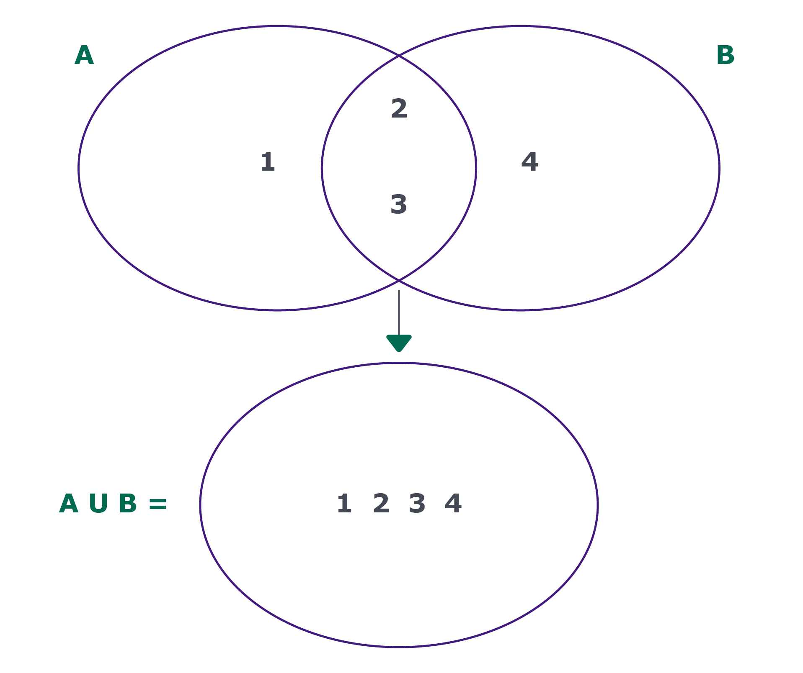
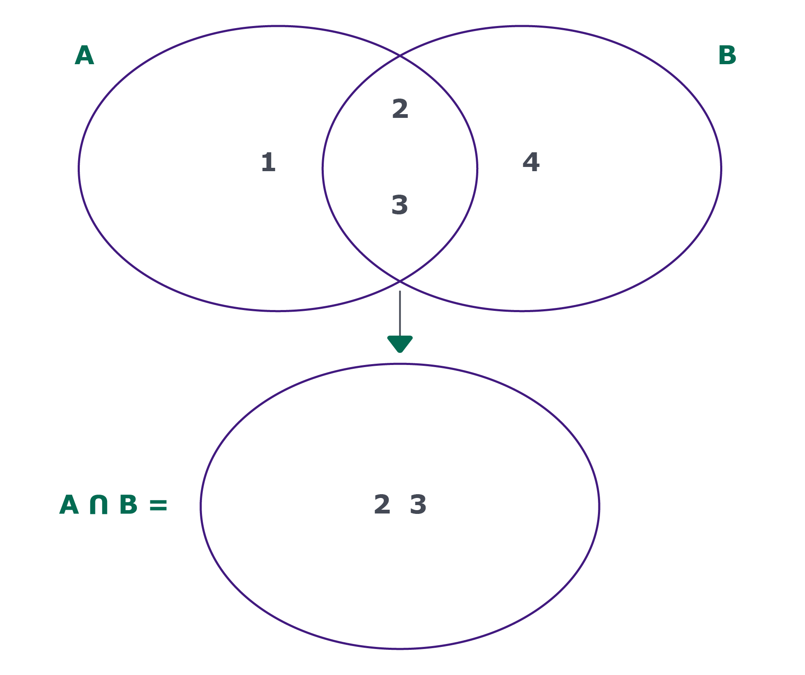
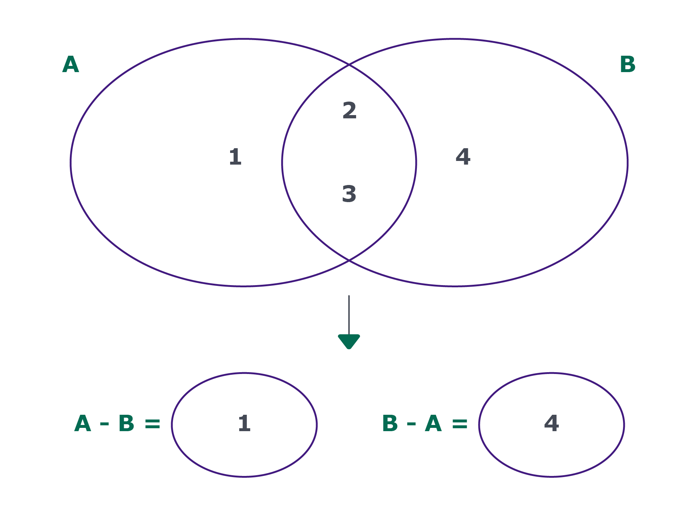
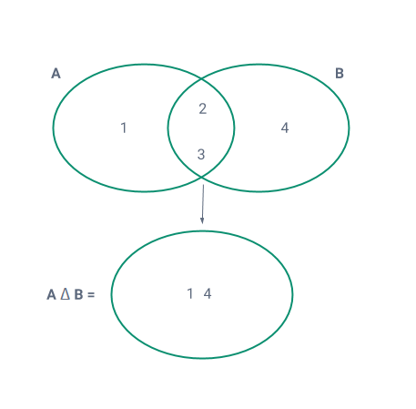
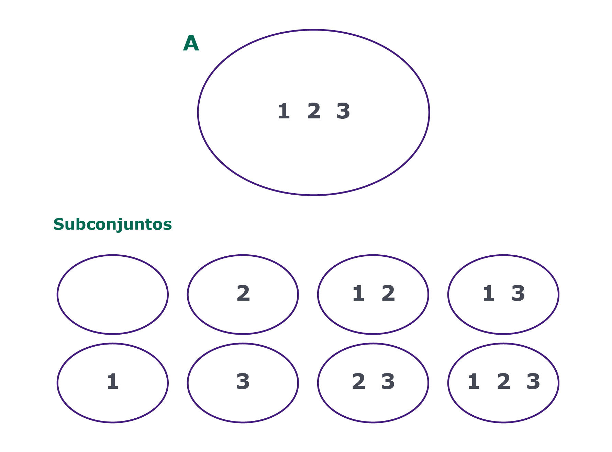

# Conceito de conjuntos

As implementações de conjuntos, nas linguagens, seguem as definições matemáticas de conjuntos. Para a matemática, um conjunto é uma coleção bem definida de elementos. Essa definição pode se dar por meio da listagem explícita dos elementos ou por meio da descrição dos elementos que o compõem:
```
# Listagem explícita:
# A = {1, 2, 3, 4, 5, 6}

# Descrição dos elementos
# B = {x | x é um número inteiro tal que 0 < x =< 6}
# Ou seja, x, onde x é um número inteiro tal que x menor igual a 6 e maior que
# zero. Ou seja, faz parte desse conjunto números maiores que 0 e menores
# iguais a 6 ({1, 2, 3, 4, 5, 6}).
```
As duas formas de descrever o conjunto acima resultam em conjuntos iguais. Porém, o conceito de igualdade entre conjuntos vai além: conjuntos são iguais se cada elemento de A pertence a B e se cada elemento de B pertence a A. Quais conjuntos abaixo são iguais?
```
A = {1, 2, 3}
B = {2, 1, 3}
C = {1, 1, 2, 2, 3, 3}
```

Os três conjuntos são iguais. O que nos leva a duas propriedades:

- A ordem não importa;
- É desnecessário manter cópias do mesmo elemento. Tudo o que precisamos que um conjunto descreva seus elementos únicos. As operações de "pertence" e "não pertence" são o que nos permite aplicar esse conceito, de igualdade. Essas operações constituem as operações básicas mais importantes de conjuntos que você já deve ter utilizado, em python, algumas vezes:
```
if element in colection:
    # ...

if element not in colection:
    # ...
```

# União

Todos os elementos que pertencem a A ou a B

<div align="center">
  
</div>

# Intersecção

Todos elementos que pertencem a A e a B

<div align="center">
  
</div>

# Diferença

Todos os elementos que pertencem a A e não pertencem a B

<div align="center">
  
</div>

# Diferença Simétrica

Todos os elementos que pertencem exclusivamente a A ou a B

<div align="center">
  
</div>

# Subconjunto

Não é uma operação. É qualquer conjunto em que todos os seus elementos pertencem ao conjunto maior (superconjunto). Conjunto Vazio e o próprio conjunto são subconjuntos dele mesmo.

<div align="center">
  
</div>

Casos em que o conjuntos são utilizados:

- Programa Educacional: um programa, temos acesso ao log de quem já entregou a avaliação 1 e de quem já entregou a avaliação 2. Queremos saber quem já entregou a 1, mas não a 2. Para isso, podemos criar uma função que verifique se uma pessoa consta no log de avaliação 1, mas não consta nos logs da avaliação 2. Os nomes dos alunos nos logs formam um conjunto, pois não são duplicados e a ordem das entregas não importa.
- SQL: um cenário onde operações sobre conjuntos são pesadamente utilizados são queries em bancos de dados. O comando SELECT cria um conjunto e comandos como UNION, INTERSECT e EXCEPT nada mais são do que operações sobre conjuntos. O SELECT cria um conjunto com linhas únicas. Utilizar um comando de conjuntos sobre os resultados de dois ou mais SELECT implicarão em eliminação de duplicados e desconsideração de ordem. [Explicação sobre set](https://pt.wikipedia.org/wiki/Opera%C3%A7%C3%B5es_SET_(SQL))

# Conjuntos representados por vetores
```
A = {1, 2, 3}
B = {2, 3, 4}
```

Os elementos são números inteiros e pequenos, podemos fazer uso dos índices de um vetor de booleanos para identificar a presença ou não de cada elemento:
```
A = [False, True, True, True, False]
#      0     1     2     3     4
```

Para saber se um elemento pertence ao conjunto, basta verificar se A[2] é True, por exemplo. O acesso direto aos endereços do vetor, consulta, inserção e remoção, ocorrem em O(1). Os lados negativos dessa implementação são:

- Caso os elementos não sejam valores pequenos;
- Caso os elementos sejam valores muito esparsos, como {1, 1000, 20000}. Assim teríamos muitos espaços subutilizados na memória;
- Caso os elementos não sejam números

# Conjuntos representados por Dict

Casos em que o vetor não se mostra uma boa solução, contendo chaves sendo strings, podemos utilizar uma hashmap. Poderíamos mapear para qualquer coisa, uma vez que esses valores nunca serão acessados e estariam lá apenas porque a hash exige. Vamo usar booleanos, que ocupam pouco espaço.
```
A = {1, 2, 3}
# 0: False
# 1: True
# 2: True
# 3: True
# 4: False
# ...
```

É importante entender as operações sobre conjuntos por de baixo dos panos:

- Para entender a complexidade das operações, precisamos saber como elas são realizadas;
- Caso a linguagem com a qual estamos trabalhando não tenha uma representação de dicada. Ou seja, a linguagem não atende as nossas necessidades. Nesse caso teríamos que implementar as operações manualmente;
- Em entrevistas de algoritmos (whiteboards), se o problema em questão for implementar uma classe "Set", é evidente que nós não poderemos utilizar os métodos prontos. Teremos que saber implementar do zero. Observação: caso a estrutura de dados seja apenas auxiliar, não é necessário implementar do zero.
